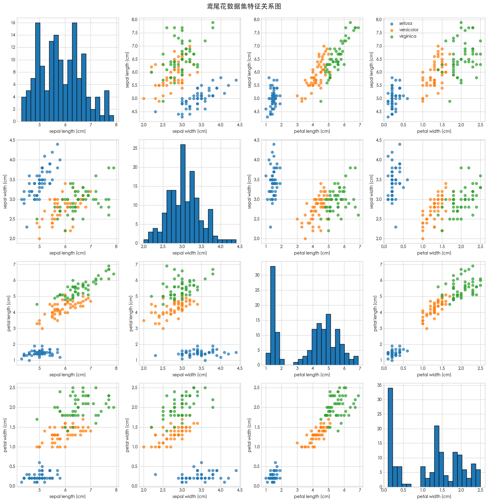

# 第 6 天

> 2025-09-01

## 学习的知识点

源码：[🔗](../practices/learn-hello.ipynb)

### 编程用到的库

- NumPy 是 Python 的 "数学引擎"，专门处理数值计算和多维数组（矩阵）
- pandas 用来专门处理结构化数据（类似 Excel 表格的数据）。常用场景：从 CSV/Excel 文件读取数据集、查看数据统计信息（平均值、最大值等）
- matplotlib.pyplot 用来绘制各种图表（散点图、折线图、直方图等）
- `from sklearn import datasets` 从库中导入内置的鸢尾花数据集
- `from sklearn.model_selection import train_test_split` 用来将数据集分成训练集（给模型 "学习" 的数据）和测试集（检验模型效果的数据）
- `from sklearn.linear_model import LogisticRegression` 用来导入逻辑回归模型，这是一个经典的分类算法（虽然名字带 "回归"，但实际用于分类）
- `from sklearn.metrics import accuracy_score` 用来导入准确率评估工具，衡量模型预测的准确率（正确预测的样本数 ÷ 总样本数）

### 代码理解

- `plt.style.use('seaborn-v0_8-whitegrid')`
  - 这行代码是用来设置 Matplotlib 绘图风格的，作用是统一统一图表的视觉样式，让绘制的图形更美观、专业。如果不设置，Matplotlib 会使用默认风格（比较朴素）。
  - 这行代码通常放在导入matplotlib.pyplot之后，绘图之前，作为全局设置影响之后所有的图表。
- `iris = datasets.load_iris()`
  - 作用：从sklearn.datasets中加载鸢尾花数据集（Iris dataset）
  - 为什么用这个数据集：它是机器学习领域的 "Hello World" 级数据，特点是：
    - 规模小（150 个样本），计算快，适合入门
    - 数据干净（无缺失值），不需要复杂预处理
    - 多分类任务（3 个品种），能直观展示分类模型的效果
  - 返回值：iris是一个特殊的 "数据集对象"，里面包含了所有和数据相关的信息（特征、标签、名称等）
- `X = iris.data` 和 `y = iris.target` 
  - **X（特征数据）**：
    - 代表样本的"属性"或"特征"，是模型用来做判断的依据
    - 这里的`iris.data`包含4个特征（对应后面的`feature_names`）：
      花萼长度、花萼宽度、花瓣长度、花瓣宽度（单位：厘米）
    - 数据格式：二维数组（矩阵），形状是`(150, 4)`，即150个样本×4个特征
  - **y（目标标签）**：
    - 代表样本的"答案"或"类别"，是模型需要学习和预测的结果
    - 这里的`iris.target`是0、1、2三个数字，分别对应3种鸢尾花品种
    - 数据格式：一维数组，形状是`(150,)`，每个数字对应`X`中同一位置样本的品种
- `print("特征数据形状:", X.shape)` 和 `print("目标标签形状:", y.shape)`
  - **作用**：通过`shape`属性快速了解数据规模：
    - `X.shape=(150, 4)`：150个样本，每个样本有4个特征
    - `y.shape=(150,)`：150个标签，与样本一一对应
  - **为什么要检查形状**：确保特征和标签的样本数量一致（都是150），否则后续模型训练会报错
- `print("特征名称:", iris.feature_names)` 和 `print("品种名称:", iris.target_names)`
  - **作用**：将抽象的数字对应到具体含义：
    - `feature_names`：告诉我们`X`中4个特征分别是什么（花萼长度、花萼宽度等）
    - `target_names`：告诉我们`y`中0、1、2分别代表什么品种：
      0→setosa（山鸢尾）、1→versicolor（变色鸢尾）、2→virginica（维吉尼亚鸢尾）
  - **意义**：让我们知道模型学习的是"通过花的测量数据判断品种"，建立数据和现实问题的联系


#### 可视化：散点图矩阵

```python
# 为了绘图，我们将数据转换为DataFrame，这样列就有名字了
    iris_df = pd.DataFrame(X, columns=iris.feature_names)
    iris_df['species'] = y # 把品种标签也加进去

    # 创建一个图形和坐标轴，4x4的网格
    fig, axes = plt.subplots(4, 4, figsize=(16, 16))

    # 双重循环，遍历所有特征组合
    for i in range(4):
        for j in range(4):
            ax = axes[i, j]
            if i == j:
                # 对角线：绘制单个特征的直方图
                ax.hist(iris_df.iloc[:, i], bins=20, edgecolor='black')
                ax.set_xlabel(iris.feature_names[i])
            else:
                # 非对角线：绘制两个特征的散点图，并按品种着色
                for species_id in range(3):
                    species_data = iris_df[iris_df['species'] == species_id]
                    ax.scatter(species_data.iloc[:, j], species_data.iloc[:, i], 
                               label=iris.target_names[species_id], alpha=0.7)
                ax.set_xlabel(iris.feature_names[j])
                ax.set_ylabel(iris.feature_names[i])
            if j == 0 and i == 0: # 只在第一个子图添加图例
                ax.legend()

    plt.tight_layout() # 自动调整间距
    plt.suptitle('鸢尾花数据集特征关系图', y=1.02, fontsize=16)
    plt.show()
```

这段代码是**通过可视化深入理解鸢尾花数据集特征关系**的核心步骤，目的是用图表直观展示4个特征之间的关联以及不同品种的差异。我们来逐部分拆解：


##### 1. 数据转换：从数组到DataFrame
```python
iris_df = pd.DataFrame(X, columns=iris.feature_names)
iris_df['species'] = y  # 把品种标签也加进去
```
- **为什么要转成DataFrame？**  
  之前的`X`是NumPy数组（只有数字，没有列名），而Pandas的DataFrame是"带列名的表格"，方便按列名筛选数据、查看特征含义。  
- **添加`species`列的作用**：把每个样本的特征（如花瓣长度）和它的品种标签（0/1/2）绑定在一起，后续绘图时能按品种区分数据点（比如用不同颜色表示）。  


##### 2. 创建绘图网格
```python
fig, axes = plt.subplots(4, 4, figsize=(16, 16))
```
- **作用**：创建一个4行4列的子图网格（共16个小图），`figsize=(16,16)`设置整个图表的尺寸（宽16英寸，高16英寸）。  
- **为什么是4x4？**：因为数据有4个特征（花萼长、花萼宽、花瓣长、花瓣宽），这样可以展示**每个特征与其他所有特征（包括自身）的关系**。  


##### 3. 双重循环绘制子图
```python
for i in range(4):
    for j in range(4):
        ax = axes[i, j]  # 获取当前子图的坐标轴
        ...
```
`i`和`j`分别代表4个特征的索引（0-3），通过双重循环遍历所有特征组合，每个组合对应一个子图。


###### （1）对角线子图：单个特征的直方图（i == j）
```python
if i == j:
    ax.hist(iris_df.iloc[:, i], bins=20, edgecolor='black')
    ax.set_xlabel(iris.feature_names[i])
```
- **直方图的作用**：展示单个特征的**数值分布**（比如"花萼长度"主要集中在哪些数值范围）。  
  - `iris_df.iloc[:, i]`：取第i个特征的所有数据  
  - `bins=20`：将数据分成20个区间，区间越多，分布越精细  
  - `edgecolor='black'`：给直方图的柱子加黑色边框，避免重叠后看不清  

- **举例**：当i=0（花萼长度），这个子图会显示150个样本的花萼长度分布，能看出它的最小值、最大值、集中区域等。


###### （2）非对角线子图：两个特征的散点图（i != j）
```python
else:
    for species_id in range(3):  # 遍历3个品种
        species_data = iris_df[iris_df['species'] == species_id]  # 筛选当前品种的数据
        ax.scatter(
            species_data.iloc[:, j],  # x轴：第j个特征
            species_data.iloc[:, i],  # y轴：第i个特征
            label=iris.target_names[species_id],  # 标签：品种名称
            alpha=0.7  # 透明度70%，避免点重叠后看不清
        )
    ax.set_xlabel(iris.feature_names[j])  # x轴标签：第j个特征名称
    ax.set_ylabel(iris.feature_names[i])  # y轴标签：第i个特征名称
```
- **散点图的作用**：展示**两个特征之间的关系**，以及不同品种在这两个特征上的**区分度**。  
  - 比如当i=2（花瓣长度）、j=3（花瓣宽度）时，散点图会显示"花瓣长度"和"花瓣宽度"的对应关系，不同颜色的点代表不同品种。  
  - 如果某两个特征的散点图中，不同颜色的点明显分开，说明这两个特征能很好地区分品种（对模型来说是"有用的特征"）。  


##### 4. 图例和布局调整
```python
if j == 0 and i == 0:  # 只在第一个子图添加图例
    ax.legend()  # 显示品种名称的标签（setosa/versicolor/virginica）

plt.tight_layout()  # 自动调整子图间距，避免标签重叠
plt.suptitle('鸢尾花数据集特征关系图', y=1.02, fontsize=16)  # 总标题，y=1.02避免被子图遮挡
plt.show()  # 显示整个图表
```


##### 这段代码的核心价值：让数据"说话"
通过这16个子图，你能直观观察到：  
- 哪些特征的分布差异大（比如花瓣长度在不同品种间可能差异更明显）；  
- 哪些特征组合能更好地区分品种（比如花瓣长度+花瓣宽度可能比花萼长度+花萼宽度的区分度更高）。  

这些观察对后续选择模型、理解模型预测逻辑非常重要——比如如果两个特征能完美区分品种，简单模型（如逻辑回归）也能达到很高的准确率。


### 机器学习可视化从 0 到 1 的思路框架
#### 一、机器学习入门项目的通用流程（核心框架）
入门级机器学习项目（尤其是分类任务），可以遵循这5步走：  
```
1. 明确问题 → 2. 获取并加载数据 → 3. 理解数据（可视化+统计分析） → 4. 准备数据（预处理） → 5. 建模与验证
```

#### 二、结合鸢尾花案例，拆解每一步的思路和代码
以鸢尾花代码为例，逐步对应通用流程，看每一步“为什么这么做”“代码是如何实现的”：

##### 步骤1：明确问题（先想清楚“要解决什么”）
- **核心问题**：通过花的4个特征（花萼长、宽，花瓣长、宽），预测它属于哪个品种（3个类别）。  
- **问题类型**：这是“监督学习中的分类任务”（已知标签，预测类别）。  
- **为什么要先明确？**：决定了后续用什么模型（分类用逻辑回归、决策树等，回归用线性回归等）。  


##### 步骤2：获取并加载数据（把数据“拿进来”）
- **数据来源**：鸢尾花数据是sklearn内置的，实际中可能来自CSV/Excel文件、数据库等。  
- **代码思路**：用工具加载数据，并分离“特征（X）”和“标签（y）”（监督学习的核心格式）。  
  ```python
  # 加载数据（sklearn内置）
  iris = datasets.load_iris()
  # 分离特征（X：模型的“输入”）和标签（y：模型的“答案”）
  X = iris.data  # 特征：4个测量值
  y = iris.target  # 标签：0/1/2（对应3个品种）
  ```  
- **迁移到其他数据**：  
  - 如果是CSV文件：用`pd.read_csv("数据路径")`加载，然后手动分离X（特征列）和y（标签列）。  
  - 关键：确保X是“影响结果的属性”，y是“要预测的结果”（比如预测房价时，X是面积/地段，y是价格）。  


##### 步骤3：理解数据（“看穿”数据的规律）
这一步是“可视化+统计分析”，目的是回答：  
- 数据有多少样本？多少特征？  
- 特征的取值范围是什么？分布是否合理？  
- 特征和标签之间有没有明显的关联（比如某个特征能很好地区分不同类别）？  

**鸢尾花代码中的实现**：  
1. 用`shape`看数据规模：  
   ```python
   print(X.shape)  # (150,4) → 150个样本，4个特征
   print(y.shape)  # (150,) → 每个样本对应一个标签
   ```  

2. 用`feature_names`和`target_names`理解特征/标签含义：  
   ```python
   print(iris.feature_names)  # 知道4个特征是花萼/花瓣的长宽
   print(iris.target_names)  # 知道0/1/2对应3个品种
   ```  

3. 用可视化（直方图+散点图）发现规律：  
   - 直方图：看单个特征的分布（比如“花瓣长度”在不同品种中是否有差异）。  
   - 散点图：看两个特征的关系（比如“花瓣长”和“花瓣宽”是否能区分品种）。  


##### 步骤4：准备数据（让数据“适合模型”）
模型是“认死理”的数学工具，需要数据满足一定格式（比如没有缺失值、特征范围合理等）。入门案例数据干净，这一步简化了，实际中可能需要：  
- 处理缺失值（用均值填充等）；  
- 特征标准化（让不同范围的特征“公平竞争”）；  
- 分割训练集和测试集（避免模型“作弊”）。  

**鸢尾花后续会加的代码**（你可能还没学到）：  
```python
# 分割训练集（80%用于学习）和测试集（20%用于检验）
X_train, X_test, y_train, y_test = train_test_split(X, y, test_size=0.2, random_state=42)
```  


##### 步骤5：建模与验证（让模型“学习”并打分）
用一个简单模型（如逻辑回归）学习特征和标签的关系，再用测试集检验效果。  

**核心代码思路**：  
```python
# 1. 选模型（逻辑回归，适合入门分类）
model = LogisticRegression()

# 2. 训练模型（用训练集“喂”数据，让模型找规律）
model.fit(X_train, y_train)

# 3. 预测（用训练好的模型，对测试集做预测）
y_pred = model.predict(X_test)

# 4. 评估（用准确率看模型猜中了多少）
print("准确率：", accuracy_score(y_test, y_pred))
```  

## 遇到的问题和解决方案
### 散点图标题加载失败
#### 问题

运行代码报错如下：
> UserWarning: Glyph 40482 (\N{CJK UNIFIED IDEOGRAPH-9E22}) missing from font(s) Arial.

这个报错的核心原因是 Matplotlib 默认使用的 Arial 字体不支持中文，导致图表中的中文标题（如 “鸢尾花数据集特征关系图”）或标签无法正常显示，出现了 “缺失字形（Glyph missing）” 的警告。

#### 解决方案
为 Matplotlib 设置支持中文的字体

在 import matplotlib.pyplot as plt 之后、创建图表（fig, axes = ...）之前，添加以下代码：

```python
# 使用 macOS 系统默认预装的中文字体
plt.rcParams["font.family"] = ["Heiti TC", "sans-serif"]
plt.rcParams['axes.unicode_minus'] = False  # 解决负号“-”显示为方块的问题
```